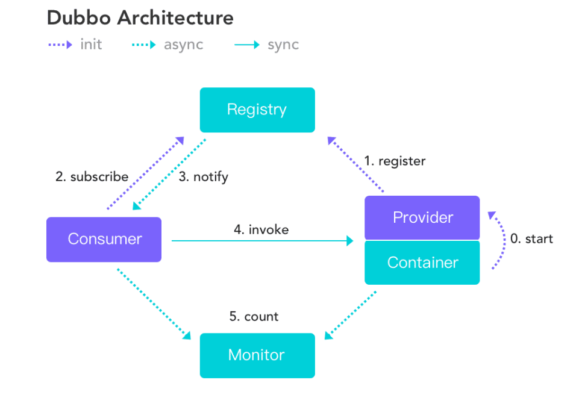
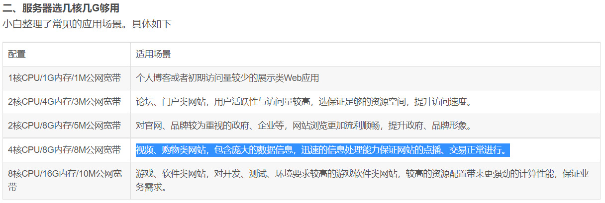
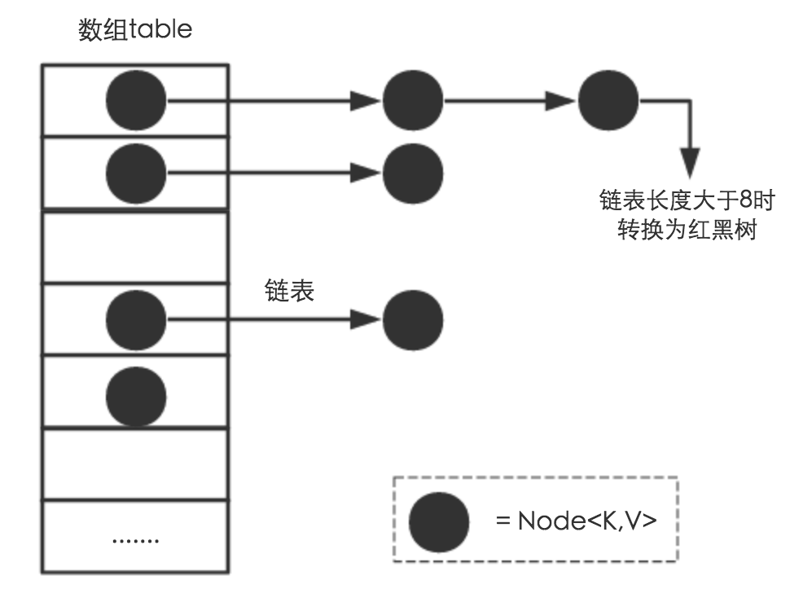
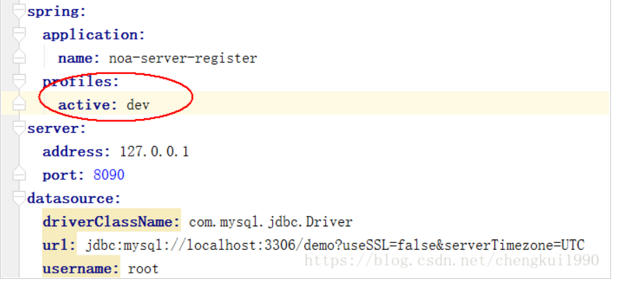

### 1、线程相关

1、线程池原理，讲讲线程池里面的核心参数，你平时是怎么用线程池的

​		1、判断**线程池里的核心线程**是否都在执行任务，如果不是（核心线程空闲或者还有核心线程没有被创建）则创建一个新的工作线程来执行任务。如果核心线程都在执行任务，则进入下个流程。

​		2、线程池判断工作队列是否已满，如果工作队列没有满，则将新提交的任务存储在这个工作队列里。如果工作队列满了，则进入下个流程。

3、判断**线程池里的最大线程数**是否都处于工作状态，如果没有，则创建一个新的工作线程来执行任务。如果已经满了，则交给饱和(拒绝)策略来处理这个任务。

```java
//创建方式一:
new ThreadPoolExecutor(corePoolSize, maximumPoolSize,keepAliveTime, milliseconds,runnableTaskQueue, threadFactory,handler);
//方式二:
ExecutorService es = Executors.newFixedThreadPool(4);
```


方式二的其他类型:

（1）newCachedThreadPool创建一个可缓存线程池，如果线程池长度超过处理需要，可灵活回收空闲线程，若无可回收，则新建线程。

（2）newFixedThreadPool 创建一个定长线程池，可控制线程最大并发数，超出的线程会在队列中等待。

（3）newScheduledThreadPool 创建一个定长线程池，支持定时及周期性任务执行。

（4）newSingleThreadExecutor 创建一个单线程化的线程池，它只会用唯一的工作线程来执行任务，保证所有任务按照指定顺序(FIFO, LIFO, 优先级)执行。

3、谈谈你理解的IO和多线程

​	IO:

- 数据传输的通道

- 读取数据是输入流

- 写出数据是输出流

  多线程:线程是进程的组成,具体执行进程任务,是CPU的基本调度单位,多个线程同时或交替执行称为多线程

4、网络io什么的

https://blog.csdn.net/qq_39898191/article/details/100025751?utm_medium=distribute.pc_aggpage_search_result.none-task-blog-2~aggregatepage~first_rank_v2~rank_aggregation-1-100025751.pc_agg_rank_aggregation&utm_term=%E7%BD%91%E7%BB%9C%E5%92%8Cio%E9%9D%A2%E8%AF%95%E9%97%AE%E9%A2%98&spm=1000.2123.3001.4430

5、实现多线程有哪些方式

​		1.继承Thread类，重写run方法
​		2.实现Runnable接口，重写run方法，实现Runnable接口的实现类的实例对象作为Thread构造函数的target
​		3.通过Callable和FutureTask创建线程
​		4.通过线程池创建线程  

6、线程的创建方法 
核心线程池的核心参数
           阻塞队列

```
BlockingQueue：阻塞队列，存储等待执行的任务。
参数有ArrayBlockingQueue、LinkedBlockingQueue、SynchronousQueue等可选。
```

​           阻塞策略(拒绝策略):

```
当提交的任务数>大于任务队列的容量+ 最大线程数量之和， 就会触发拒绝策略。

JDK自带4中策略。

1.abort策略，默认策略，该策略出发时，会抛出异常。

2.CallerRuns策略，直接运行这个任务。

3.Discard策略。直接丢掉这个任务。

4.DiscardOldest，丢掉任务队列中的第一个任务，然后将新任务添加进行。
```


7、线程的五种状态，有哪些方法控制他们状态，wait和sleep的区别，

```
1. 新建状态(New): 线程对象被创建后，就进入了新建状态。例如，Thread thread = new Thread()。

2. 就绪状态(Runnable): 也被称为“可执行状态”。线程对象被创建后，其它线程调用了该对象的start()方法，从而来启动该线程。例如，thread.start()。处于就绪状态的线程，随时可能被CPU调度执行。

3. 运行状态(Running): 线程获取CPU权限进行执行。需要注意的是，线程只能从就绪状态进入到运行状态。

4. 阻塞状态(Blocked): 阻塞状态是线程因为某种原因放弃CPU使用权，暂时停止运行。直到线程进入就绪状态，才有机会转到运行状态。阻塞的情况分三种：
 (01) 等待阻塞 -- 通过调用线程的wait()方法，让线程等待某工作的完成。
 (02) 同步阻塞 -- 线程在获取synchronized同步锁失败(因为锁被其它线程所占用)，它会进入同步阻塞状态。
 (03) 其他阻塞 -- 通过调用线程的sleep()或join()或发出了I/O请求时，线程会进入到阻塞状态。当sleep()状态超时、join()等待线程终止或者超时、或者I/O处理完毕时，线程重新转入就绪状态。

5. 死亡状态(Dead): 线程执行完了或者因异常退出了run()方法，该线程结束生命周期。
```


7、threadlocal线程复用问题:

```
顾名思义，线程池会重用固定的几个线程，一旦线程重用，那么很可能首次从 ThreadLocal 获取的值是之前其他用户的请求遗留的值。这时，ThreadLocal 中的用户信息就是其他用户的信息。

我们可能会抱怨学多线程没用，因为代码里没有开启使用多线程。但其实，可能只是我们没有意识到，在 Tomcat 这种 Web 服务器下跑的业务代码，本来就运行在一个多线程环境（否则接口也不可能支持这么高的并发），并不能认为没有显式开启多线程就不会有线程安全问题。

因为线程的创建比较昂贵，所以 Web 服务器往往会使用线程池来处理请求，这就意味着线程会被重用。这时，使用类似 ThreadLocal 工具来存放一些数据时，需要特别注意在代码运行完后，显式地去清空设置的数据。(调用remove方法)

原文链接：https://blog.csdn.net/fy_java1995/article/details/107880479
```


参考文献2:

https://blog.csdn.net/grant167/article/details/79610295?ops_request_misc=%7B%22request%5Fid%22%3A%22162945984716780261981626%22%2C%22scm%22%3A%2220140713.130102334..%22%7D&request_id=162945984716780261981626&biz_id=0&utm_medium=distribute.pc_search_result.none-task-blog-2~all~baidu_landing_v2~default-2-79610295.first_rank_v2_pc_rank_v29&utm_term=threadlocal%E7%BA%BF%E7%A8%8B%E5%A4%8D%E7%94%A8%E9%97%AE%E9%A2%98&spm=1018.2226.3001.4187

### 2、必问相关

1、特别是jvm，hashmap，redis，mq这几个

2、hashmap，秒杀，jvm内存、gc，spring 生命周期bean、ioc、aop，sql优化，springboot自动装配原理，分布式锁，es，mq，分布式事物，这些都是高频面试问题，前面几个是必问

### 3、==spring-cloud相关==

1.Dobbu是怎么配置的？超时时间多少，重试次数多少？

```
在Spring中的配置:
JVM 启动参数、dubboXML、dubbo.properties(yml)  
```

2.Dobbu的实现原理是什么？



3.nginx的负载均衡怎么配的？

```
user  nginx;
worker_processes  1;

error_log  /var/log/nginx/error.log warn;
pid        /var/run/nginx.pid;

events {
    worker_connections  1024;
}

http {
    include       /etc/nginx/mime.types;
    default_type  application/octet-stream;
    
log_format  main  '$remote_addr - $remote_user [$time_local] "$request" '
                  '$status $body_bytes_sent "$http_referer" '
                  '"$http_user_agent" "$http_x_forwarded_for"';

access_log  /var/log/nginx/access.log  main;

sendfile        on;

keepalive_timeout  65;

server {
    listen       80;
    listen  [::]:80;
    server_name  localhost;
	#反向代理
    location / {
        proxy_pass http://mytomcat/;
    }

}

#-----------------------如下的部分是修改的------------------
#权重策略: 代表10次请求，有1次是访问到tomcat8082,其他的都是访问到tomcat8081
upstream mytomcat {
	server 192.168.20.129:8081 weight=9;
	server 192.168.20.129:8082 weight=1;
}
}
```


https://www.runoob.com/w3cnote/nginx-proxy-balancing.html

4.es中怎么使用索引？
5.跨域问题怎么解决？

https://blog.csdn.net/weixin_38003389/article/details/88872308?ops_request_misc=&request_id=&biz_id=102&utm_term=%E8%B7%A8%E5%9F%9F%E9%97%AE%E9%A2%98%E6%80%8E%E4%B9%88%E8%A7%A3%E5%86%B3&utm_medium=distribute.pc_search_result.none-task-blog-2~all~sobaiduweb~default-6-.nonecase&spm=1018.2226.3001.4187


6.redis和zk分布式锁的区别  

redis分布式锁，其实需要不断去尝试获取锁，比较消耗性能

zk分布式锁，获取不到锁，注册个监听器即可，不需要不断主动尝试获取锁，性能开销较小

redis如果获取锁的那个客户端bug了或者挂了，那么只能等待超时时间之后才能释放锁

而zk，因为创建的是临时znode，只要客户端挂了，znode就没了，此时就自动释放锁

zk中，删除node即释放锁
———————————————
原文链接：https://blog.csdn.net/ranjio_z/article/details/105370435

7.布隆过滤器怎么配的？

- 引入依赖

```xml
<dependency>
      <groupId>org.redisson</groupId>
      <artifactId>redisson</artifactId>
      <version>3.6.5</version>
    </dependency>
```

- 示例：

```java
package com.qf.myspringbootredisdemo;

import org.junit.jupiter.api.Test;
import org.redisson.Redisson;
import org.redisson.api.RBloomFilter;
import org.redisson.api.RedissonClient;
import org.redisson.config.Config;
import org.springframework.boot.test.context.SpringBootTest;

@SpringBootTest
public class TestBoolFilter {

  @Test
  public void testBool(){


    Config config = new Config();
    config.useSingleServer().setAddress("redis://172.16.253.34:6379");
    config.useSingleServer().setPassword("qfjava");
    //构造Redisson
    RedissonClient redisson = Redisson.create(config);

    RBloomFilter<String> bloomFilter = redisson.getBloomFilter("nameList");
    //初始化布隆过滤器：预计元素为100000000L,误差率为3%,根据这两个参数会计算出底层的bit数组大小
    bloomFilter.tryInit(100000000L,0.03);
    //将xiaoming插入到布隆过滤器中
    bloomFilter.add("xiaoming");

    //判断下面号码是否在布隆过滤器中
    System.out.println(bloomFilter.contains("xiaoli"));//false
    System.out.println(bloomFilter.contains("xiaowang"));//false
    System.out.println(bloomFilter.contains("xiaoming"));//true
  }
}

```


8.熔断器怎么做限流？

```
 hystrix的两种降级方式

- 信号量		@HystrixCommand(书写配置)
- 线程池		设置线程池线程数,阻塞队列大小,超时时间
```

https://blog.csdn.net/Anbang713/article/details/85916559

https://blog.csdn.net/qq_36031640/article/details/89366664?utm_medium=distribute.pc_relevant.none-task-blog-2%7Edefault%7ECTRLIST%7Edefault-3.no_search_link&depth_1-utm_source=distribute.pc_relevant.none-task-blog-2%7Edefault%7ECTRLIST%7Edefault-3.no_search_link

9.es版本之间的区别？每个版本之间区别很大

```
5.0.0版本(大转折):Lucene 6.x 的支持，磁盘空间少一半；索引时间少一半；查询性能提升25%；支持IPV6。引入新的字段类型 Text/Keyword 来替换 String

7.0.0版本:正式废除单个索引下多Type的支持，es6时，官方就提到了es7会删除type，并且es6时已经规定每一个index只能有一个type。在es7中使用默认的_doc作为type，官方说在8.x版本会彻底移除type
```

10.springCloud里有那些组件？

​		Eureka、Ribbon、OpenFeign、Hystrix、Zuul

11.redis里放了那些数据？

​		String 、 Hash 、set 、zset 、list

12、数据库用户模块使用了redis来解决重复注册的问题，如何用关系型数据库解决？


13.Redis除了RedisTemplate，还有什么可以操作？

​		还可以使用Jedis，获取连接对象

14.Redis解缓存雪崩、缓存击穿、缓存穿透的产生原理以及解决
方案

​		参考笔记

15、redis内存利用率多少

```
极限情况：留出一倍内存。比如你的redis数据占用了8G内存，那么你还需要再预留8G空闲内存。也就是内存需求是16G。内存占用率低于50%是最安全的。

普通情况：正常情况下，在序列化周期内，不会更改所有数据，只会有部分数据更改，那么，预留出可能产生的更改部分的空间，就行。如果实在要说一个数据的话，内存占用率低于75%都是安全的。
————————————————
原文链接：https://blog.csdn.net/chenggong2dm/article/details/79306151
```


16、他还问服务器的配置多少核多少内存多少cpu，压测的时候系统水位多少、cpu利用率多少，内存利用率多少



17、redis分布式锁的那个方法怎么实现的？vue简单唠一唠

​		redisTemplate.opsForValue().setIfAbsent

19.eureka怎么注册，怎么维护和调用

​	注册中心:导入依赖、编写配置文件、启动类上加@EnableEurekaServer

​	服务提供者：导入依赖、编写配置文件（配置注册中心信息）、启动类上打上注解 @EnableEurekaClient

​	服务消费者（Ribbon）：导入依赖、编写配置文件（配置注册中心信息）、启动类上打上注解 @EnableDiscoveryClient、	编写配置类注入RestTemplate、使用RestTemplate进行调用

20.Hystrix怎么用

​	在消费端启动类上打上注解@EnableHystrix

​	在要设置熔断的方法上加注解@HystrixCommand(fallbackMethod = "xxx")，并设置错误回调方法, 回调方法访	问修饰符、返回值、参数列表与原方法相同

21.zuul网关什么情况下进行回调

​	zuul中整合了hystrix，可以给zuul配置熔断方法，当zuul在进入路由转发时，配上熔断器的效果，如果下游服务出现问题则会触发熔断。触发熔断实际上是给zuul的调用方返回一个响应消息，因此整个熔断方法的配置实际上就是在配置一个响应消息。

22、Eureka 有什么作用

​	服务注册、服务续约、服务剔除、服务调用、服务同步、服务下线、获取服务、自我保护

23、Eureka 和 Zookeeper (作为注册中心)的区别

```
1、一致性（Consistency，C）：在分布式系统中的所有数据备份，在同一时刻是同样的值。（等同于所有节点访问同一份最新的数据副本）。

2、可用性（Availability，A）：在一个分布式系统的集群中一部分节点故障后，该集群还能够正常响应客户端的读写请求。（对数据更新具备高可用性）。

3、分区容错性（Partition tolerance，P）：大多数的分布式系统都分布在多个子网络中，而每个子网络就叫做一个区（partition）。分区容错的意思是，区间通信可能失败。比如阿里巴巴的服务器（不知道各位有没有发现，不管你到那个城市去，你访问的服务器总是该城市的，其中使用 了算法，由于篇幅有限就不再这儿一一讲解了），一台服务器放在上海，另一台服务器放在北京，这就是两个区，它们之间可能存在无法通信的情况。在一个分布式系统中一般分区容错是无法避免的，因此可以认为 CAP 中的 P 总是成立的。CAP 理论告诉我们，在 C 和 A 之间是无法同时做到。


ZooKeeper 基于 CP，不能保证高可用，Eureka 基于AP，能保证高可用。
作为注册中心而言，配置是不经常变动的，只有当新版本发布或者服务器出故障时会变动。CP 不合适于配置经常变动的，而 AP 在遇到问题时可以牺牲其一致性来保证系统服务的高可用性，既返回旧数据。
```


24、Redis 和 Zookeeper 创建分布式锁的过程 有什么区别

```
Redis :setnx（set not exist，如果key值为空，则正常设置，返回1，否则不会进行设置并返回0）操作，如果设置成功，表示已经获得锁，否则并没有获取锁。
zk: 设置
```

```
zk如何上读锁

- 创建一个临时序号节点，节点的数据是read，表示是 读锁
- 获取当前zk中序号比自己小的所有节点
- 判断最小节点是否是读锁：
  - 如果不是读锁的话，则上锁失败，为最小节点设置监听。阻塞等待，zk的watch机制会当最小节点发生变化时通知当前节点，于是再执行第二步的流程
  - 如果是读锁的话，则上锁成功

zk如何上写锁

- 创建一个临时序号节点，节点的数据是write，表示是 写锁
- 获取zk中所有的子节点
- 判断自己是否是最小的节点：
  - 如果是，则上写锁成功
  - 如果不是，说明前面还有锁，则上锁失败，监听最小的节点，如果最小节点有变化，则回到第二步。
```


25、我写了参与部分技术方案的编写 他问了 一下 我描述了 后端的微服务架构  他有问到RPC 和 HTTP 的区别  为什么这么用


27、项目中zk的应用

```
zk作为注册中心

分布式协调组件

分布式锁

无状态登录

秒杀服务中可能出现的不公平问题->使用zk节点监听
```

28.redis平时在哪里用到

```
缓存服务器
分布式锁
分布式session
排行榜
热点缓存
社交类需求
模拟队列和栈的效果
购物车
计数器
```


29.redis怎么设置过期时间

```
redis.expire(key, expiration)
```

31. 缓存雪崩解决方案

    ```
    - 使用缓存的集群。实现redis的高性能和高可用
    - 设置熔断器
    - 压测项目的最大并发数，设置限流方案。
    ```

    

32. 假如在处理redis里的消息时出问题，redis的内存被打满是什么怎么处理的；

    淘汰机制:当redis中的内存达到了设置的最大内存时，那么就出发了未过期键的主动清理策略(MAXMEMORY POLICY)。会选择使用volatile-lru这种策略，但是会对性能有影响。

33. 消息队列的机制

    

### 4、==秒杀库相关==

1、秒杀业务要理顺，最好结合下单业务一起整理思路。这个过程面试官会穿插问一些用到的技术栈，redis，MQ，zk等相关问题都可能问到。分布式锁、幂等性等与秒杀直接相关的技术一定要了解。
2、一般会有编码题，这个大部分是操作字符串得到指定的结果。比如：在一个字符串中，得到第一个不重复的字符。可以到网上找一些有关问题做一下。
3、ThreadLocal在项目中用在那个地方，有什么作用
4、CurrentHashMap原理
5、==和equals
6、为什么服务内用rpc，服务外用http
别的我忘记了，都是基础的面试题。还要说一下，对于我面试的情况，问项目、面试题和编码题的时间是4：3：1，所以一定把秒杀讲清楚了，甚至redis\MQ中储存了什么具体数据，越细越好。

7、秒杀的购物车是放redis里的？不是秒杀的购物车，正常情况下的购物车放在哪里操作执行？项目里面有多少个微服务？
数据库里怎么保证超卖，少卖？

8、面试被问到秒杀怎么开启，秒杀订单创建成功但没有付款的情况怎么办

9、面试被问到秒杀怎么开启，秒杀订单创建成功但没有付款的情况怎么办

10.下订单到结款的具体流程

11.问到秒杀项目，会根据项目 问你一些设计 思想  有没有扩展的空间 中间开发过程中有没有什么问题  问的非常灵活 我回答的很勉强 感觉项目这块 还是比较麻烦

例子：汉克 二面（50分钟 基础知识基本没有偏离课上内容  项目只问了秒杀 回答的较差 ）

12.秒杀业务中怎么保证数据库的安全    超卖 少卖的解决方案  

13.统计订阅人数：
同时有N个商品（用long类型的商品id表示），每个商品都可以被任何一个用户（long类型的用户id）订阅，每被订阅一次，该商品的订阅数加1，同一个用户对同一个商品只能订阅一次 编辑写一个类，用3个方法提供以下功能（这3个方法都是在单机多线程环境下调用）：

1. 为指定的用户id订阅指定的商品id
    2.返回所有商品的订阅总数

  3.根据商品ID返回这个商品的订阅数

14.解决超卖少卖问题为什么不用分布式锁

15.限流怎么实现的，
16、重复下单问题，

### 5、集合相关

1.hashmap的核心源码，为什么当链表长度大于8并且数组长度大于64时，会转换为红黑树,在红黑树的元素小于6的时候会变成链表

​		红黑树的平均查找长度是log(n)，长度为8，查找长度为log(8)=3，链表的平均查找长度为n/2，当长度为8时，平均查找长度为8/2=4，这才有转换成树的必要；链表长度如果是小于等于6，6/2=3，虽然速度也很快的，但是转化为树结构和生成树的时间并不会太短。还有选择6和8的原因是：中间有个差值7可以防止链表和树之间频繁的转换。

官方解释 : 注释上说了作者是根据概率学的角度来决定的，因为根据统计，一个桶位置上的节点数目的分布式泊松分布，长度超过8的概率十分小，所以作者选用了8作为链表转为红黑树的阈值

​		链表转换为红黑树的最终目的，是为了解决在map中元素过多，hash冲突较大，而导致的读写效率降低的问		题。因为链表的读取效率较低,需要一个个遍历比较.

2.红黑树	

```
红黑树的性质：
红黑树是一棵平衡二叉搜索树，它在每个节点增加了一个存储位记录节点的颜色，可以是RED,也可以是BLACK；通过任意一条从根到叶子简单路径上颜色的约束，红黑树保证最长路径不超过最短路径的二倍，因而近似平衡。

具体性质如下：
每个节点颜色不是黑色，就是红色
根节点是黑色的
如果一个节点是红色，那么它的两个子节点就是黑色的（没有连续的红节点）
对于每个节点，从该节点到其后代叶节点的简单路径上，均包含相同数目的黑色节点
```


3.（上一个问题引申）linkedlist如何（在不破坏链表结构下）删除某个节点上的数据。

4.ConcurrentHashMap和hashtable线程安全有什么区别

```
	Hashtable 实现并发安全的原理是通过 **synchronized** 关键字，对整个map上锁

​	对于ConcurrentHashMap的原理，本质上它实现线程安全的原理是利用了 CAS(乐观锁) + synchronized 		+ Node 节点(分段式锁)的方式，这和 Hashtable 的完全利用 synchronized 的方式有很大的不同
	且concurrenthashmap的get方法是不上锁的，value在1.7和1.8都用volatile修饰，获取的值都是最新的，十分高效
```

5.说说你对Hashmap的认识（有多少说多少,尽量把磊哥的那份资料吃透）

```
HashMap是基于哈希表实现的,每一个元素是一个key-value对,其内部通过单链表解决冲突问题,容量不足(超过了阀值)时,同样会自动增长.

HashMap是非线程安全的,只适用于单线程环境,多线程环境可以采用并发包下的concurrentHashMap

HashMap 实现了Serializable接口，因此它支持序列化，实现了Cloneable接口，能被克隆

HashMap是基于哈希表的Map接口的非同步实现.此实现提供所有可选的映射操作,并允许使用null值和null键.此类不保证映射的顺序,特别是它不保证该顺序恒久不变.

Java8中又对此类底层实现进行了优化，比如引入了红黑树的结构以解决哈希碰撞
```



6.ConcurrenHashMap 的底层 , 进而介绍sychronized 和 CAS 

https://blog.csdn.net/jy02268879/article/details/88599830

7.hashMap底层数据结构及实现原理

​				HashMap的主干是一个Entry数组。Entry是HashMap的基本组成单元，每一个Entry包含一个key-value		键值对。

​				HashMap:简单来说，HashMap由数组+链表组成的，数组是HashMap的主体，链表则是主要为了解决		哈希冲突而存在的，如果定位到的数组位置不含链表（当前entry的next指向null）,那么对于查找，添加等操		作很快，仅需一次寻址即可；如果定位到的数组包含链表，对于添加操作，其时间复杂度为O(n)，首先遍历		链表，存在即覆盖，否则新增；对于查找操作来讲，仍需遍历链表，然后通过key对象的equals方法逐一比对		查找。所以，性能考虑，HashMap中的链表出现越少，性能才会越好。

​		HashMap并不是线程安全的,安全的有HashTable、concurrentHaspMap等


9.hashmap为什么使用红黑树不使用别的树，对单一抽象层次怎么理解的，arraylist，

```
	红黑树和AVL树都是**最常用的平衡二叉搜索树**，它们的查找、删除、修改都是O(lgn) time

		AVL树和红黑树有几点比较和区别：
		（1）AVL树是更加严格的平衡，因此可以提供更快的查找速度，一般读取查找密集型任务，适用AVL树。
		（2）红黑树更适合于插入修改密集型任务。
		（3）通常，AVL树的旋转比红黑树的旋转更加难以平衡和调试。
```

10.集合有哪些，hashset如何保证存放的对象不重复

			HashSet保证元素不重复是通过两部分实现的，第一步通过比较两个对象的哈希码是否相同如果相同，只能怀疑是相同对象，那么进而就会调用equals就行二次确认，如果确认完毕之后相同，那么就会排除第二个，否则的话就会插入该元素。因此，如果要保证存入对象的内容不同的时候就需要同时重写hash()和equals()方法自己定义比较的规则，一定要保证相同内容的对象的哈希码是相同的，不同对象的哈希码是不同的。
12.hashmap除了链表变红黑树有什么其他的设计是为了减少hash碰撞

13.有哪些集合是有序的

​		实现了 List 接口的集合类全部有序：比如ArrayList、LinkedList
​		TreeSet：基于TreeMap实现。

​		LinkedHashMap：在 HashMap 的基础上多维护了一个双向链表。
​		ConcurrentSkipListMap：基于跳表实现，跳表内所有的元素都是排序的。
​		TreeMap：基于红黑树实现。

14.集合扩容机制,默认大小

ArrayList集合默认初始为空集合,当第一个元素添加的时候才会调用capycity方法,给他赋上默认初始容量10

https://www.cnblogs.com/whu-2017/p/9677212.html

### 6、spring相关

1.IOC创建对象的流程>>ioc aop 核心原理 
2.循环依赖怎么解决

3.ioc，aop以及使用场景

4、springboot如何使用yml加载指定配置文件

程序会先拿到这个属性，放到profiles属性中，重新去加载配置文件如application-dev.yml（如下图）



为什么用mybatis配置文件不用全注解开发：

​		经验：注解模式属于硬编码到.java文件中，失去了使用配置文件外部修改的优势。且注解开发有时候比xml配置文件更麻烦，有些SQL语句会很复杂，例如链表查询等都会比较麻烦。由此可见XML配置方式可维护性更强。

5.对动态代理的理解，动态代理的两种方式，哪些场景用到了动态代理

6.springmvc的注解：

```
@Controller 
@RequestMapping

@RequestBody      @RequestBody允许request的参数在request体中，而不是在直接链接在地址后面。此注解放在参数前。
@ResponseBody     @ResponseBody支持将返回值放在response体内，而不是返回一个页面。我们很多机遇Ajax的程序，可以以此注解返回数据而不是返回页面；此注解可以放在返回值或者方法上。

@PathVariable     @PathVariable 用来接收路径参数，如/news/001,可接收001作为参数，此注解放置在参数前。

@RestController   @RestController是一个组合注解，组合了@Controller和@ResponseBody，意味着当只开发一个和页面交互数据的控制的时候，需要使用此注解。 若没有此注解，要想实现上述功能，则需自己在代码中加@Controller和@ResponseBody两个注解。

```


7.springBoot核心注解，@SpringBootApplication的组成，自动化配置原理；

核心注解:@SpringBootApplication

（一）、@ComponentScan 注解

（二）、@EnableAutoConfiguration 注解

（三）、@SpringBootConfiguration 注解

```
@ComponentScan 注解用于扫描该项目包下的所有spring注解，将该包下的实例bean(诸如：@Component，@Controller，@Service，@Repository等注解修饰的Bean)注入spring容器中

@EnableAutoConfiguration注解 翻译过来就是开启自动配置，是springboot自动配置最核心的注解。@EnableAutoConfiguration注解导入了一个比较重要的Java类，即AutoConfigurationImportSelector，从字面理解这个类就是 ”选择自动导入的配置信息“，其中这个类中的selectImports()方法就是去获取需要自动配置的候选类。具体的如下:
	通过selectImports()中的getCandidateConfigurations()方法获取候选配置类，这个方法其实就是通过spring的工具类SpringFactoriesLoader.loadFactoryNames去扫描所有具有META-INF/spring.factories的jar包。

@EnableAutoConfiguration注解通过@SpringBootApplication被间接的标记在了Spring Boot的启动类上。在SpringApplication.run(…)的内部就会执行selectImports()方法，找到所有JavaConfig自动配置类的全限定名对应的class，然后将所有自动配置类加载到Spring容器中。

@SpringBootConfiguration继承自@Configuration，二者功能也一致，标注当前类是配置类，
并会将当前类内声明的一个或多个以@Bean注解标记的方法的实例纳入到spring容器中，并且实例名就是方法名。
```


8.aop,ioc原理；

9.你在开发中ioc和aop的应用场景。

10.@Autowired  @Resource 区别

​	1、@Autowired与@Resource都可以用来装配bean. 都可以写在字段上,或写在setter方法上。 
​	2、@Autowired默认按类型装配（这个注解是属于spring的），默认情况下必须要求依赖对象必须存在，如果要允许null 值，可以设置它的required属性为false，如：@Autowired(required=false) ，如果我们想使用名称装配可以结合@Qualifier注解进行使用，如下： 


```
@Autowired() 
@Qualifier("baseDao")     
private BaseDao baseDao;    
```
​	3、@Resource（这个注解属于J2EE的），默认安照名称进行装配，名称可以通过name属性进行指定， 
如果没有指定name属性，当注解写在字段上时，默认取字段名进行按照名称查找，如果注解写在setter方法上默认取属性名进行装配。 当找不到与名称匹配的bean时才按照类型进行装配。但是需要注意的是，如果name属性一旦指定，就只会按照名称进行装配。  


```
@Resource(name="baseDao")     
private BaseDao baseDao; 
```


### 7、==mysql进阶(高级)相关==

1.mysql索引结构

​		B+树，一个节点大小默认16K，可以存放多条数据，放不下为止，非叶子节点存放叶子节点的键，叶子节点存放数据，叶子节点从小到大，从左到右排列，叶子节点提供了指针，增强区间访问性能。

2.为什么使用B+做索引，B树和B+树的区别

```
B+树的特点：

1.非叶子节点冗余了叶子节点的键

2.叶子节点从小到大，从左到右排列

3.叶子之间提供了指针，提高了区间访问的性能

4.只有叶子节点存放数据，其他节点不存放数据，只存放键。
```


3.mysql的InnoDB和MyISAM有什么区别

```
1.InnoDB存储引擎
对于InnoDB存储引擎来说，数据是放在叶子节点上的。
	如果是主键索引：数据是整条记录——聚集索引（索引树和数据是在一起的）
	如果是非主键索引：叶子节点中的数据存放的是主键——辅助索引、二级索引、它也是非聚集索引
天生支持行锁，也可以手动支持表锁。
	
	
2.MyISAM存储引擎将索引和数据分开来两个文件来存储，当查到索引后还需要去另外一个数据文件中拿数据，这样的话性能比较差，因此在追求性能的场景中都不会去使用MyISAM存储引擎。——非聚集索引
早期版本只有MyISAM支持全文检索。
MyISAM天生支持表锁。==》非常安全。没有并发可言
```


4.主要的SQL优化有哪些，值为null的字段建立索引可以命中吗

```
order by 优化

group by优化

分页查询优化

join优化

in和exists优化

count优化
```


1. sql查找select *与具体字段哪个快 

   ==如果有覆盖索引肯定是具体字段快,否则如果是选上了所有列,速度差不多==

2. 100w个数中间少一个 快速找出来是哪个

3. 索引键能不能为空 为什么 

   不能,null不走索引

4. mysql和redis的双写一致性

   使用canel

5. 在你的项目里会不会有缓存穿透的问题

   用了布隆过滤器解决(或者是返回空对象)

6. 声明式事务

### 8、javaSE相关

1.stringbuffer和stringbuild的区别？
2.arraylist和linkedlist的区别？

4.继承和实现的区别？
5.==和equal的区别？

6、集合{

1、数据结构不同
ArrayList是Array(动态数组)的数据结构，LinkedList是Link(链表)的数据结构。
2、效率不同
当随机访问List（get和set操作）时，ArrayList比LinkedList的效率更高，因为LinkedList是线性的数据存储方式，所以需要移动指针从前往后依次查找。
当对数据进行增加和删除的操作(add和remove操作)时，LinkedList比ArrayList的效率更高，因为ArrayList是数组，所以在其中进行增删操作时，会对操作点之后所有数据的下标索引造成影响，需要进行数据的移动。
3、自由性不同
ArrayList自由性较低，因为它需要手动的设置固定大小的容量，但是它的使用比较方便，只需要创建，然后添加数据，通过调用下标进行使用；而LinkedList自由性较高，能够动态的随数据量的变化而变化，但是它不便于使用。
4、主要控件开销不同
ArrayList主要控件开销在于需要在lList列表预留一定空间；而LinkList主要控件开销在于需要存储结点信息以及结点指针信息。

}

7.堆和栈有什么区别，内部结构

​			**一、堆**(先进先出)

​			(1)Java的堆是一个运行时数据区，类的对象从堆中分配空间。这些对象通过new等指令建立，通过垃圾回			收器来销毁。

​			(2)堆的优势是可以动态地分配内存空间，需要多少内存空间不必事先告诉编译器，因为它是在运行时动态			分配的。但缺点是，由于需要在运行时动态分配内存，所以存取速度较慢。

​			**二、栈**(先进后出)

​			(1)栈中主要存放一些基本数据类型的变量(byte，short，int，long，float，double，boolean，char)、对			象的引用和函数主体，遵循先入后出的原则。

​			(2)栈的优势是，存取速度比堆快，栈数据可以共享。但缺点是，存放在栈中的数据占用多少内存空间需要			在编译时确定下来，缺乏灵活性。

8.垃圾回收发生在哪里

​		栈内存:变量基本上用完就回收了。

​		堆内存:数组和对象等引用类型在没有变量指向它的时候才被视为垃圾。

​		在随后的一个不确定的时间被垃圾回收器释放掉。

9.1.7与1.8的区别，（头插法和尾插法，为什么1.8要这样设计）


### 9、锁相关

1、NIO和BIO的区别，高并发下用NIO，然后接着问了一个如果一个用户一个线程岂不是更慢？我没回答出来，

2、synchronized和lock的区别。

3、redis怎么做分布式锁的。

4、介绍一下dubbo。剩下都是秒杀相关的了，还有mq怎么保证消息投递的

5、乐观锁的使用场景

6、CAS锁

7、zookeeper 分布式锁  冗余部署数据一致性问题   和 redis的区别 

### 10、jvm相关

1.超类object有哪些方法；
2.介绍下JVM，各个区域，程序计数器用途，哪一个区域是线程独享的哪一块区域是线程共有的；
3.分布式事务，描述下TCC模式（AT,SAGA,XA）；

4、jvm原理两个gc区别

5.jvm本地方法栈

6.怎么预防死锁

```
避免多次锁定。尽量避免同一个线程对多个 Lock 进行锁定。例如上面的死锁程序，主线程要对 A、B 两个对象的 Lock 进行锁定，副线程也要对 A、B 两个对象的 Lock 进行锁定，这就埋下了导致死锁的隐患。
具有相同的加锁顺序。如果多个线程需要对多个 Lock 进行锁定，则应该保证它们以相同的顺序请求加锁。比如上面的死锁程序，主线程先对 A 对象的 Lock 加锁，再对 B 对象的 Lock 加锁；而副线程则先对 B 对象的 Lock 加锁，再对 A 对象的 Lock 加锁。这种加锁顺序很容易形成嵌套锁定，进而导致死锁。如果让主线程、副线程按照相同的顺序加锁，就可以避免这个问题。
使用定时锁。程序在调用 acquire() 方法加锁时可指定 timeout 参数，该参数指定超过 timeout 秒后会自动释放对 Lock 的锁定，这样就可以解开死锁了。
死锁检测。死锁检测是一种依靠算法机制来实现的死锁预防机制，它主要是针对那些不可能实现按序加锁，也不能使用定时锁的场景的。
```


7.JVM堆中存什么，栈中存什么

```
堆:new 出来的对象
栈:栈帧-对应一个方法调用
	栈帧包含如下四个内容：
		- 局部变量表：存放方法中的局部变量
		- 操作数栈：用来存放方法中要操作的数据
		- 动态链接：存放方法名和方法内容的映射关系，通过方法名找到方法内容
		- 方法出口：记录方法执行完后调用此方法的位置。
9.类加载器有哪些，双亲委派的好处
10.垃圾回收算法
```

11.说说你对JVM 的了解有哪些
      我回答了 JVM内存结构之后说了上课的哪些
      又问了GC什么哪几种 

12.jvm调优     用了哪些jdk工具      类加载器       gc      什么会被垃圾回收   

### 11、docker-Linux相关

1.docker配置有了解嘛

2.Linux的命令，比如查看内存是否占用，删除文件，修改文件

### 12、并发相关

面试官问我压测的时候多少，我说一万多，又问我限流多少，我说10万，那他说你这限流没啥用啊，然后问我qps多少，我说峰值八千多，均值2.3左右，他又问，你这才八千对于redis来说高了还是低了，我说低了，redis能撑10万，他说那你还把结束标记存jvm缓冲，还要配zookeeper，不麻烦吗，我说并发不高的时候可以放redis，这样设计为了大流量进来更能提升性能，他又怼说我你压测一万多还大流量。我是不是压测说低了

### 13、笔试题目相关

1、//评测题目: 有两个字符串A和B，请输出这两个字符串倒序后的和。例如
// A: 652
// B: 123
// A倒序后为256，B倒序后为321，所以输出数值为256+321=577。
// 请注意输入为字符串，输出为数值。请注意处理所有输入情况。

2、我那两道是：1.输出数组中占比超过一半的单个数字，如果没有就输出-1；2.合并两个有序数组让合并后数组依旧有序（不让合并之后用sort方法）

3、蓝川科技笔试题：工厂模式，单例模式，快速排序，复杂sql，jquery，的伪代码手写。面试题：对哪个框架理解最深，介绍一下原理，项目介绍了一下然后讲了下消息积压的解决，

### 14.图片资料


### 15、面试实时资料

1.武汉佰钧成，一面基础jvm，内存结构，垃圾回收机制，二面项目介绍秒杀，库存为什么放到redis，redis的数据结构，库存用的哪种，为什么用hash不用string，redis并发为什么好，分布式事务怎么保证库存扣减一定成功，幂等性怎么保证的，线程池的执行原理，答了课上说的又问了更底层的原理知不知道，我说不知道，项目中拿到数据怎么进行数据库的建表和数据写入，sql效率怎么查看，慢sql怎么查看，dubbo和zk这一套的原理，底层netty和nio的原理，为什么nio相比io效率更快，三面场景spring的理解，aop怎么用的，动态代理问的很细，方法a里面调用方法b两种场景：a方法有@trasanctional注解b方法没有，a方法有这个注解b方法没有，问两种情况分别有没有事务

2.晚上阿里面试：java的锁的区别，redis雪崩，击穿；zk的锁；hashmap；mysql的默认隔离级别；乐观锁，悲观锁

3.阿里外包二面：主要还是线程池，和一些基本的排序算法吧，然后其他就是现实开发大概的流程，如技术方案怎么写，谁写，一个需求来了，到交付大概的流程，

4.共道科技一面：sql优化，kafka细节，spring，springboot，springcloud，fegin，eureka，docker和dockercompose基本命令，项目发布的流程，线上出问题咋办，gitlab工作流，项目有几种环境

5.视频面，秒杀中redis上分布式锁作为排队标记是怎么实现的，mysql优化索引怎么建，有什么要求，abc三个字段怎么匹配最左前缀法则，一个场景：在mysql中ab两张表字段一样，a表是空的没有数据，b表有数据，怎么写sql吧b表的数据写到a表，一条sql能不能实现，其他没了，都是技术之外的为题

6.秒杀：画时序图
访问秒杀结束标记，还判断库存吗，还是原子操作吗，逻辑是怎样的！！
分布式锁为什么不一开始在访问就使用，setnx具体作用，
访问库存的流程，有job吗，redis和mysql数据同步怎么实现，
为什么要使用zk？
下单时依然出现超卖要怎么解决，如何保证mysql数据，可以用乐观锁来解决吗，
sql索引失效的情况 ，原理是什么，
kafka出现消息积压怎么解决，怎么保证消费可靠性， 
手写一个requestmapping，加载url原理。

7.华萃面试，mysql优化建索引时对字段有什么要求，什么类型的字段适合建索引，在哪些场景中用到kafka，redis原子操作解决超卖少买是具体是怎么实现的，索引失效的情况

8.在mysql中插入多条数据，但是其中一个数据发现错了，问怎么回滚，还有安全框架security中怎么根据不同的权限显示不同的页面，是怎么实现的

### 16、其他

1、最左前缀法则

2、volatile的工作内存，主内存

3.项目怎么打包怎么运行

4.项目具体数据量多大，日志多大 

5.你在之前的开发中有什么让你印象深刻的问题

6.项目有多少人

7.有一个问题 大家思考下，面试也常问：你项目中最近碰到的一个问题，怎么解决？——答案可以去晨考里找，或者把秒杀里碰到的问题拿出来说

